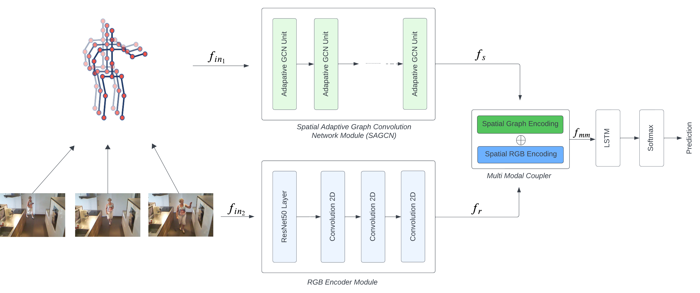

# MMAGCN

This repository holds the codebase and models for the work:

**MMNet: Multi-Modal Adaptive Graph Convolution Network for Human Activity Recognition**
Prasad Maduranga, Damminda Alahakoon, Isuru Senadheera, Rashmika Nawarathne, Leeanne Carey

<div align="center">
    
</div>

## Abstract

In the domain of skeleton-based action recognition, graph convolutional networks
(GCNs) have shown promising results by modelling human body skeletons as
spatiotemporal graphs. However, existing GCN-based techniques often handle
spatial and temporal features simultaneously, limiting their ability to incorporate
and fuse other modalities of data with the skeleton information. To address this
limitation, we propose a novel neural network architecture that enables the fusion
of multiple modalities of spatial data while harnessing the power of adaptive
graph convolution for skeleton-based action recognition. Our approach focuses on
handling spatial and temporal aspects separately, demonstrating improved results
compared to existing methods that perform simultaneous spatial and temporal
convolutions.

We conduct extensive experiments on two large-scale datasets, NTU-RGBD and
Toyota-smarthome, demonstrating that our model outperforms the state-of-the-
art methods by a margin of 0.8% and 0.6% for each data set, respectively.
Additionally, our architecture allows fusion of multiple modalities of information,
making it suitable for recognizing fine-grained human activities, especially those
involving human-object interactions.

## Prerequisites
- Python3 (>3.5)
- [PyTorch](http://pytorch.org/)
- Other Python libraries can be installed by `pip install -r requirements.txt`


## Data Preparation
### Datasets

#### Toyota Smarthome Dataset
Toyota smarthome dataset can be downloaded from [their website](https://project.inria.fr/toyotasmarthome/).
The **3D skeletons** modality and the RGB modality are required in our experiments. After that, this command should be used to build the database for training or evaluation:
```
python  ./tools/data_gen/smarthome_gendata.py --data_path <path to smarthome_skeletons>
python  ./tools/data_gen/smarthome_rgb_gendata.py --data_path <path to smarthome_rgb data>
```
where the ```<path to smarthome_skeletons>``` points to the 3D skeletons modality and ```<path to smarthome_rgb data>``` points to the RGB video data of Toyota Smarthome dataset you download

Since the processed data is quite large , we do not provide it here.

#### NTU RGB+D 60 Dataset
NTU RGB+D can be downloaded from [their website](https://rose1.ntu.edu.sg/dataset/actionRecognition/).
The **3D skeletons**modality and the RGB modality are required in our experiments. After that, this command should be used to build the database for training or evaluation:
```
python ./tools/data_gen/ntu60_gendata.py --data_path <path to nturgbd+d_skeletons>
python ./tools/data_gen/ntu60_rgb_gendata.py --data_path <path to ntu_60 rgb data>

```
where the ```<path to nturgbd+d_skeletons>``` points to the 3D skeletons modality and ```<path to ntu_60 rgb data>``` points to the RGB modality of NTU RGB+D dataset you download.

Since the processed data is quite large , we do not provide it here.


## Training and Testing

### Train and evaluate on Toyota Smarthome

```
python smarthome_train_eval.py --config ./config/smarthome/cross_subject/train_joint.yaml
```
make sure to change the config file to the desired configuration file.

### Train and evaluate on NTU RGB+D 60

```
python ntu_60_train_eval.py --config ./config/ntu60/cross_subject/train_rgb_joint.yaml
```
make sure to change the config file to the desired configuration file. Change the yaml file for different modalities and different training strategies.

## Acknowledgements
This repo is based on following repos:

- [ST-GCN](https://github.com/yysijie/st-gcn)
- [2s-AGCN](https://github.com/lshiwjx/2s-AGCN)
- [MMNET](https://github.com/bruceyo/MMNet)

Thanks to the original authors for their work!


## Contact
For any question, feel free to contact Prasad Hettiarachchige: ```P.HETTIARACHCHIGE@latrobe.edu.au```
